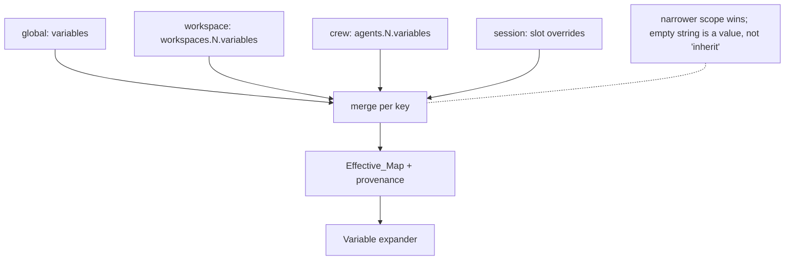
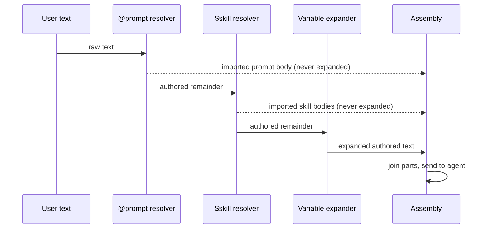

# Design Document

> Code citations name a file and a symbol, never a line number: the anchors in this spec drifted twice during implementation (once across 315 commits of `main`, once across 45), and a number that is wrong reads as authoritative.

## Overview

Crew Variables adds user-defined key/value pairs at four scopes that cascade — global, workspace, crew, session — and expands them as `{{name}}` in the text Kiro Crew sends to an agent. It introduces one new module, three new config fields, and a handful of expansion call sites. It introduces no new file on disk, no new value in any child process environment, and no expansion in any machine-readable surface.

Three properties do the work of keeping it safe, and every other decision follows from them:

1. **Expansion is confined to operator-authored text.** Four surfaces expand: the dashboard composer message, the agent system prompt, a cron `message`, and a monitor/auto-nudge instruction. A `SKILL.md` body, an `@prompt` file body, and a steering file do not — and neither does an inbound channel message, because that text is authored by a channel participant rather than by the operator (see "Surfaces that deliberately do not expand"). This is what makes "a value is as trusted as text the operator typed" a true statement rather than a hope, and it is why neither a skill installed from the public registry nor a user merely permitted to message the bot can read a variable.
2. **`$skill` and `@prompt` resolution happens against pre-expansion text.** A value therefore cannot load a skill or inline a prompt file, structurally, without sanitizing values.
3. **Expansion is single-pass.** A substituted value is never rescanned, so there are no cycles and no escalation through nested tokens.

The codebase already states principle 1 in prose. The `$skill` gate at `dashboard/chat_runner.py` reads:

```python
        # Operates ONLY on the user's typed message, never on @prompt-substituted
        # content: `prompt_expanded` is True when an @prompt body replaced `message`
        # above (at the same _prompt_depth=0), so we skip $skill here to prevent a
        # prompt author's embedded $tokens from silently loading extra skills into
        # the context (expand-what-the-user-typed, principle of least surprise).
```

This design extends "expand what the user typed" from `$skill` to `{{var}}`.

## Architecture

### New module: `src/kiro_crew/variables.py`

Everything lexical and validating lives in one leaf module importing nothing from `kiro_crew` beyond `typing`. That constraint is not stylistic — `cron.py` duplicates the `$skill` regex verbatim with the comment *"duplicated here to avoid a cron<->skills import cycle"*, and a variables module that must be importable from `config/loader.py`, `context.py`, `dashboard/chat_runner.py`, `cron.py` and the autonudge handler would hit the same wall if it reached back into any of them.

```python
RESERVED_TOKENS: frozenset[str]     # MAX_SUBAGENTS, VERBOSITY_BLOCK, WIDGET_BLOCK,
                                    # STOP_FILE, ALIAS, bot_name
NAME_RE: re.Pattern                 # ^[A-Za-z][A-Za-z0-9_]*$
TOKEN_RE: re.Pattern                # \{\{\s*([A-Za-z][A-Za-z0-9_]*)\s*\}\}
MAX_VALUE_LEN: int = 4096

def validate_pair(key: str, value: object) -> tuple[str, str] | tuple[None, str]:
    """Return (key, coerced_value) or (None, rejection_reason)."""

def expand(text: str, values: Mapping[str, str]) -> tuple[str, frozenset[str]]:
    """Single-pass substitution. Returns (result, unresolved_names).

    Unknown names are left byte-identical. An empty mapping returns the input
    object unchanged without scanning it.
    """
```

`expand` uses one `TOKEN_RE.sub` with a replacement **callable**, so a value containing `{{other}}`, `\1` or `\g<0>` is inserted literally — `re.sub` with a function never re-interprets the replacement. That single choice satisfies the single-pass and no-recursion requirements at once.

### Config schema

```jsonc
{
  "variables": { "orgName": "Acme", "baseUrl": "https://api.dev.internal" },
  "workspaces": {
    "ops": { "dir": "workspace-ops", "variables": { "queue": "oncall" } }
  },
  "agents": {
    "oncall": {
      "kiro_agent": "kirocrew", "workspace": "ops",
      "variables": { "baseUrl": "https://api.example.com" }
    }
  }
}
```

Three dataclass changes in `config/loader.py`: `variables: dict[str, str]` on `KiroCrewConfig`, `variables: dict[str, str]` on `WorkspaceConfig` (`loader.py`), `variables: dict[str, str]` on `KiroCrewAgentConfig` (`loader.py`). Each carries `_meta` metadata so it appears in `config-baseline.json` like every other field.

One migration trap: `_migrate_workspaces` (`loader.py`) reads only `dir` —

```python
        elif isinstance(value, dict):
            result[name] = WorkspaceConfig(dir=value.get("dir", "workspace"))
```

— so any other key is silently dropped on the next save. It must be taught `variables`, with a save round-trip test, or per-workspace values will vanish the first time an unrelated config write happens.

### Resolution

```python
@dataclass
class VariableResolution:
    values: dict[str, str]                    # the Effective_Map
    winning_scope: dict[str, str]             # key -> global|workspace|crew|session
    shadowed: dict[str, list[str]]            # key -> scopes it overrode
    rejected: list[tuple[str, str, str]]      # (scope, key, reason)

def resolve_variables(
    config: KiroCrewConfig,
    agent: str | None = None,
    session_overrides: Mapping[str, str] | None = None,
) -> VariableResolution
```

Layers merge global → workspace → crew → session, each overriding per key. The workspace layer applied is the one the session actually resolved to, which `resolve_agent_bindings` (`loader.py`) already derives — including its existing warn-and-fall-back when a crew names a missing workspace, so the variable layer inherits that behavior rather than reimplementing it.

The merge is keyed on **key presence, not truthiness**. `resolve_memory_store_config` (`loader.py`) skips an empty value because an unset field there means "inherit"; here an empty string is a legitimate value meaning "deliberately blank at this scope", so `if key in layer` is the test, not `if layer[key]`.



**Provenance is a separate, colder path.** `KiroCrewConfig.load()` deep-merges `config.local.json` over `config.json` (`loader.py`) *before* dataclass parsing, so by the time the dataclasses exist, which file supplied a pair is gone. Rather than thread provenance through the loader — invasive, and hot — a `variable_sources()` helper re-reads the two raw dicts and reports per key and scope. Winning-scope and shadowing information comes from the merge itself and is cheap; only the per-file attribution needs the re-read. Called by `kirocrew vars list/show`, `GET /api/variables` and `doctor`; never per message.

### Session layer

The session layer exists because a pure cascade otherwise has no answer to "flip this one value mid-conversation": the only lever would be switching crew, and switching crew resets the session (`dashboard/chat_handlers.py`). It is modeled on the per-session model override — a slot field plus `PUT /api/chat/slots/{slot}/variables`, transient, never written to config, cleared when the session ends. It is deliberately the last thing built (see the task plan) so it can be dropped without touching any other layer.

### Expansion call sites

There is no single funnel. `ContextBuilder.build_message` (`context.py`) takes one `text: str` parameter and is the funnel for the *context prelude* across all ten of its callers, but the dashboard's user message is finalized separately — `chat_runner` mutates `message` through the `@prompt` and `$skill` stages and only later combines it at `chat_runner.py`. So expansion is applied per boundary, with a source guard against a missed one.

| Surface | Where | Note |
|---|---|---|
| Agent system prompt | `context.py`, after both prompt branches converge | Must sit after `_load_agent_prompt` so a custom agent's own prompt content is covered too. `_resolve_prompt_templates` has ONE call site shared by all three prompt branches, so it is NOT bypassed for custom agents -- the convergence point is required for the prompt BODY, not for the token pass |
| Dashboard chat message | `chat_runner.py`, between resolution and assembly | The one refactor in this design |
| ~~Inbound channel message~~ | **NOT expanded — withdrawn.** No expander on any inbound dispatch: `messaging/dispatch.py`, `slack/handler.py`, `slack/transport_dispatch.py`, `discord/transport_dispatch.py`, `telegram/transport_dispatch.py` (the `messaging` layer covers Webex, WeCom, Weixin and Teams) | This text is Participant_Text, not operator configuration; expanding it disclosed operator config to anyone in `allowed_users`. Held by the ratchet `test_variables_channels.py::TestNoInboundTransportExpands`, which fails if any of those five regains an expander. These paths still pass an explicit crew, because the agent system prompt — which IS operator-authored — still expands on a channel turn |
| Cron `message` | `cron.py`, at dispatch | Editing a variable changes the next run; the stored job is untouched. Expansion runs on `message` BEFORE `last_result` is prepended: that block is a previous run's MODEL OUTPUT, so scanning it would expand tokens the model wrote |
| Monitor loop instruction | `dashboard/handlers/autonudge.py`, before the `{{STOP_FILE}}` replace | Reserved token resolves last |

### The one refactor: caller-controlled assembly in `chat_runner`

Both text-importing helpers currently resolve *and* concatenate, returning a single string: `_expand_prompt_mention` (`chat_runner.py`) returns `(expanded_message, status)` with the prompt body prepended, and `_expand_dollar_skills` (`chat_runner.py`) returns `(expanded_message, count)` having appended one `[Skill: name]` block per resolved skill.

Because both fold Imported_Text into the same string as Authored_Text, expanding that string would expand skill and prompt bodies. Each is split into a parts-returning form and the caller assembles:

```python
authored, prompt_blocks, _status = _resolve_prompt_mention(message, state, slot)
if "$" in authored and not is_slash and not prompt_expanded and _prompt_depth < 1:
    authored, skill_blocks, _n = _resolve_dollar_skills(authored, state, slot, session_key)

authored, unresolved = variables.expand(authored, resolution.values)   # Authored_Text only

message = "\n\n".join([*prompt_blocks, authored, *skill_blocks])
```

This ordering is what makes the refusal and no-escalation requirements structural: the `$skill` and `@prompt` resolvers see pre-expansion text, so no value can load either; and the blocks they return never pass through `expand`.



### Surfaces that deliberately do not expand

`mcpServers` `command`/`args`/`env`, agent spec JSON, and app manifests are untouched. `env` is opaque string→string passthrough today, validated only for shape at `dashboard/handlers/mcp_custom.py` and copied verbatim into a 0600 sidecar at `mcp_gateway/rewriter.py`; `${env:VAR}` reaches a child as a literal. Leaving that alone is a decision: with secrets out of scope, expanding into `env` would add a credential-shaped path with none of the protections a credential needs. Agent spec JSON is excluded on the authority of the `_placeholder_values` docstring (`apps/bridges.py`), which requires that its values never come from a writable location — and `config.json` is writable.

Steering files are excluded for the same reason as skills: `_load_steering_resources` (`context.py`) globs `file://` resources including project-scoped paths, so a cloned repository's steering file is no more trusted than a registry skill.

**Inbound channel messages are excluded, and this one is a reversal.** An earlier draft of this design expanded them on every transport (Requirement 4.4, now withdrawn). A variable's value is operator configuration; an inbound message is authored by a channel participant, and `allowed_users` admits several people. Expanding inbound text therefore turned "send the bot `{{NAME}}` and read the reply" into a read primitive over operator config — a disclosure that does not depend on the values being secrets, because the operator never opted into publishing them. Widening the boundary from Slack to Discord and Telegram widened the disclosure rather than completing the feature. Restoring expansion needs a trustworthy operator-vs-participant identity at the dispatch boundary, which the transport layer does not carry; that is a security design decision, not plumbing. The refusal is held by a ratchet enumerating the inbound transport modules (`test_variables_channels.py::TestNoInboundTransportExpands`) rather than by convention.

## Data model summary

| Config key | Type | Default | Scope |
|---|---|---|---|
| `variables` | `dict[str, str]` | `{}` | global |
| `workspaces.<n>.variables` | `dict[str, str]` | `{}` | that workspace |
| `agents.<n>.variables` | `dict[str, str]` | `{}` | that crew |
| (slot field, not config) | `dict[str, str]` | `{}` | one session |

Validation, applied identically at every scope from one code path: name matches `^[A-Za-z][A-Za-z0-9_]*$`, name is not a Reserved_Token, value coerces to `str` from `str|bool|int|float`, length ≤ 4096, no ASCII control characters except tab. A rejected pair is dropped with a warning naming key, scope and reason; the rest of the scope survives.

## Interfaces

### CLI

```
kirocrew vars list [--workspace NAME] [--agent NAME]   # effective map + winning scope + file
kirocrew vars show KEY                                  # value at every scope, winner marked
kirocrew vars set KEY VALUE [--workspace NAME | --agent NAME] [--local]
kirocrew vars unset KEY [--workspace NAME | --agent NAME] [--local]
```

Scope defaults to global when no selector is given. Modeled on the `workspace` verb group (`cli.py`, handler `cli_commands.py`). Note there is no `use` verb and none is needed — that was the cost of named sets, and a cascade has no active-set concept to switch.

### HTTP

- `GET /api/variables` → every scope's pairs, the Effective_Map for a requested context, per-key winning scope and supplying file.
- `PUT /api/variables` → create/update/delete pairs at a named scope; 400 with the offending key named on validation failure.
- `PUT /api/chat/slots/{slot}/variables` → session layer (last task; droppable).

### UI

Settings gains an **Environment Variables** panel — `website/src/pages/SettingsPage.tsx` holds the registry as a function returning `{ key, label: i18nT(...), icon, group, description }` entries plus a render switch, so this is one import, one entry, one switch line, and one new `website/src/pages/settings/VariablesPanel.tsx`. It goes in `GROUP_PREFERENCES` beside Skills: both are stores of user-authored content, unlike the `GROUP_SYSTEM` cluster. The panel leads with **Global Environment Variables** and also lists per-workspace pairs, so a workspace layer is editable without visiting another page.

The crew form on the Agents page gains the crew's own pairs beside the existing workspace, memory-store and model fields — `website/src/pages/KiroCrewAgentsPage.tsx` already renders those three as `Field` + `SimpleSelect`, so the shape is established.

Each row shows its winning scope and whether it shadows a broader one. The composer flags an unknown `{{name}}` before submission, reusing `website/src/components/composerTokens.ts`.

## Key decisions

**A cascade, not switchable named sets.** Postman needs named environments because a collection is not a context; Kiro Crew has real scope objects, so values hang on them and no second selector is introduced. The cost is that there is no one-click dev→prod flip: you change context by switching crew (which resets the session) or by editing a value. The session layer is the mitigation. If a named set is wanted later it is additive — a crew's layer is already a bag, so a set name is an indirection added at the leaf without changing any other scope.

**Variables live on the workspace as values, not as a switcher.** Hosting *values* per workspace is fine and is what the cascade needs; hosting the *selector* there would not work, since `WorkspacePicker.tsx` is create-only, `api.chatSlotWorkspace` is referenced only by tests, and `KiroCrewCfgTab.tsx` renders workspaces read-only. The workspace layer reaches a session through the crew's existing binding.

**"Environment Variables" in the UI, `variables`/`variables` in config.** The user-facing term is the one users know. The config keys avoid `env` because it already denotes the process environment, `mcpServers.env`, and `~/.kiro/crew/.env` here.

**An unknown token stays literal.** Silently substituting empty turns `curl {{baseUrl}}/health` into `curl /health`, which an agent may act on. A literal `{{baseUrl}}` is visibly wrong.

**Single-pass, with no value sanitizing.** Values are inserted verbatim. Safe only because `$skill`/`@prompt` resolution runs first and expansion never touches Imported_Text. Had either been relaxed, values would need escaping, and escaping a URL or a jq filter correctly is a worse problem than reordering a pipeline.

**Original text is stored unexpanded.** Session history keeps what the user typed, so a session read back later shows `{{baseUrl}}`, not a stale value.

**Local overrides come free.** `config.local.json` is already deep-merged over `config.json`, giving a shared-vs-machine-local split at every scope with no new mechanism. Note for unattended runs: cron and monitor paths resolve the same Effective_Map a dashboard session for that crew would, which means they read the local layer too — Postman's equivalent split sends only *shared* values to monitors and scheduled runs. The divergence is documented rather than silently differing; matching Postman here would be a deliberate later change.

## Error handling

| Condition | Behavior |
|---|---|
| Invalid name, reserved name, bad type, oversize, control char | Pair dropped, WARNING naming key + scope + reason, rest of scope retained, load succeeds |
| Crew names a missing workspace | Fallback workspace's layer applied, matching `resolve_agent_bindings`' existing warning |
| Every layer empty | Empty Effective_Map; `expand` returns the input object unscanned |
| Unknown `{{name}}` in Authored_Text | Left literal; returned in `unresolved`; surfaced once per message in the dashboard |
| Malformed token (`{{ }}`, `{{1abc}}`, `{{a-b}}`) | Left literal; not reported as unresolved |
| `{{name}}` in Imported_Text | Left literal; not logged at INFO or above |
| Pre-existing top-level `variables` key preserved by `_extra_sections` | Parsed as the Global_Layer; failing pairs reported, not silently discarded |

No condition aborts a turn or fails a config load.

## Testing strategy

**Unit — `variables.py`.** Token grammar including the malformed cases; `expand` returning the identical object for an empty mapping; single-pass proof (a value containing `{{other}}` where `other` is also defined stays literal); values containing `\1` and `\g<0>` inserted verbatim; one test per `validate_pair` rejection reason; `RESERVED_TOKENS` asserted to cover every `{{...}}` literal found by scanning `context.py`, `dashboard/handlers/autonudge.py` and `slack_manifest.py`, so a future built-in token cannot be added without updating the list.

**Unit — resolution.** Each layer alone; each adjacent pair overriding; a four-layer stack where every layer defines the same key; an empty string at a narrow scope beating a non-empty broad one; missing-workspace fallback with the warning asserted; provenance reporting winning scope, shadowed scopes, and supplying file across both config files. A save round-trip asserting `workspaces.<n>.variables` survives `_migrate_workspaces`. Derive every path from `tmp_path` — never a bare literal like `/x`, which resolves to a different drive on Windows.

**Security — the three that matter.** A value is absent from the assembled prompt when the only reference is inside a `SKILL.md` body. A value of `$<a real installed skill>` does not load that skill. A value of `@<a real prompt file>` does not inline it. Each asserts on the assembled text, not an internal flag.

**Source guard.** A test enumerating the expansion boundaries that fails when a new `build_message` caller appears without one — the countable-guard pattern the repo already uses for armed-resource release paths, chosen because the failure mode here is a silently missed surface rather than a wrong value. For the inbound transports the guard runs the OTHER way: a ratchet asserting no transport dispatch ever *gains* an expander, since there the silent failure is a regained surface, not a missed one. A newly added transport dispatch belongs in that ratchet, not in the boundary list.

**Frontend.** Panel render, add/edit/delete at each scope, scope/shadow indicators, validation error surfacing, unknown-token composer hint, crew-form pairs, a11y. Run the full `npx vitest run --no-coverage` from `website/`, since colocated specs assert exact label text.

**Gates, at CI parity.** `isort --check-only src/kiro_crew test`, `flake8 src/kiro_crew test`, `mypy src/kiro_crew/`, `npx tsc -b` from `website/`, then after `git fetch origin`: `I18N_BASE_REF=origin/main npm run i18n:check`, the render gate with the same base ref, and `HARNESS_BASE_REF=origin/main python3 scripts/check_harness_parity.py`. Every new behavior revert-verified.

## Out of scope

**Secrets — decided, not deferred.** There is no secret, secure, masked or encrypted variable type, and the UI and docs say so plainly. The reason is measured rather than cautious: `_AGENT_DENIED_ENV_KEYS` (`sandbox.py`) is a closed set of 13 literals and `_SENSITIVE_ENV_PREFIXES` is 5 literal prefixes, so nothing today scrubs a user-named key from an agent subprocess. Postman's model shows the shape of a real fix — secret-capability there is a store with an encryption key plus an enforced `vault:` namespace that may not be added to an ordinary variable scope, and script access is a per-consumer opt-in that errors when disabled. A later phase can add that as its own store under its own reference namespace; nothing in this design needs to change to accommodate it, which is precisely why no half-measure belongs here.

**Agent-set variables.** Postman's `pm.environment.set()` has no analogue. `config.json` is a governance surface — `_clamp_security_bounds` runs after the merge and policy pins reject specific keys even via `--local` — and making it agent-writable is a separate security conversation.

**`${env:VAR}` in `mcpServers`.** Useful and much smaller, but independent of this feature and safe to ship separately.
